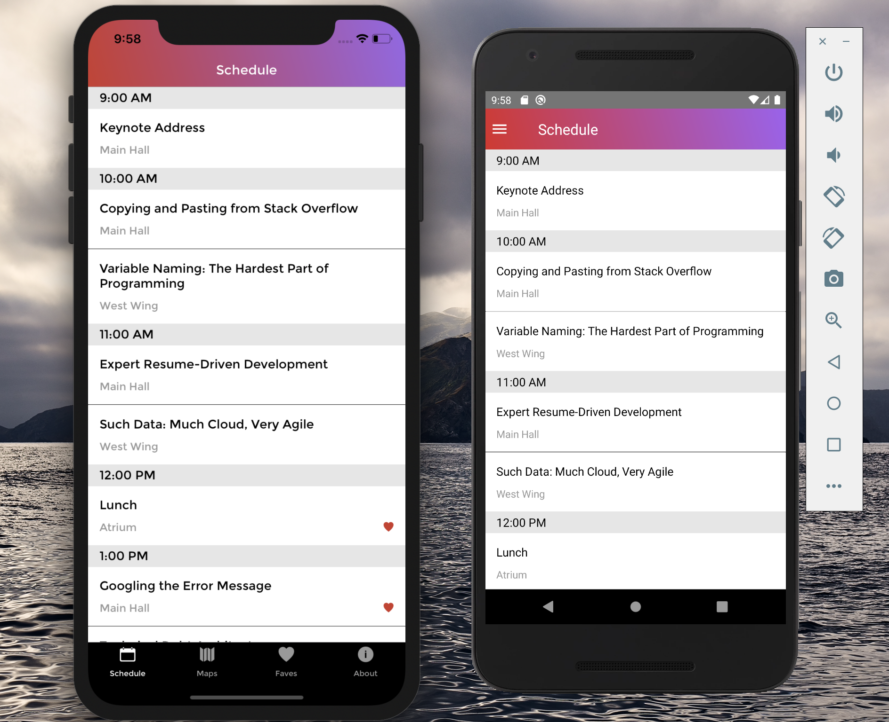
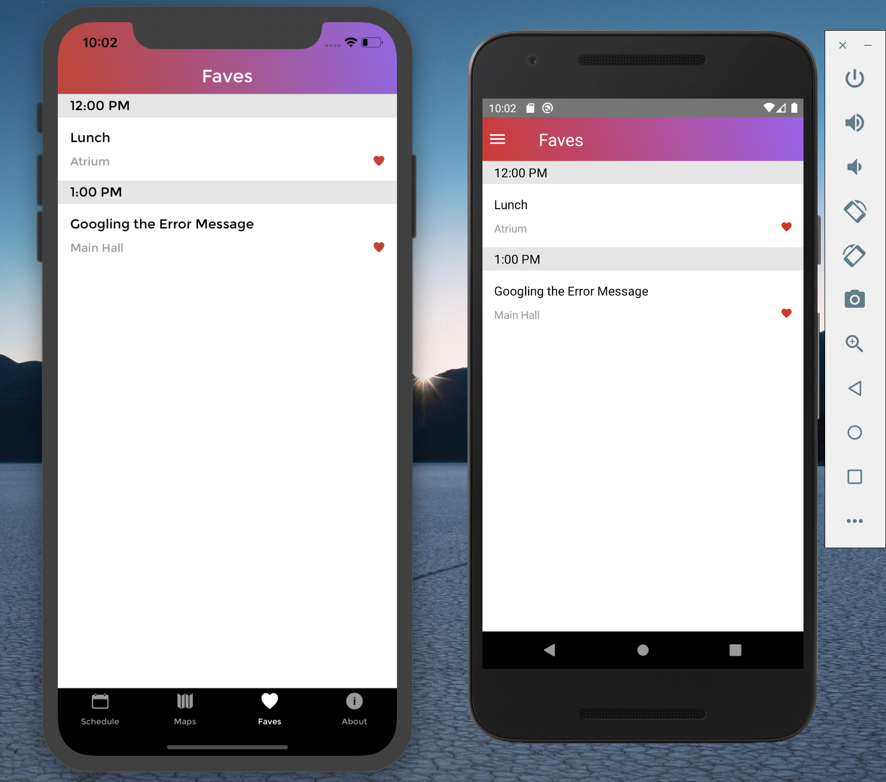
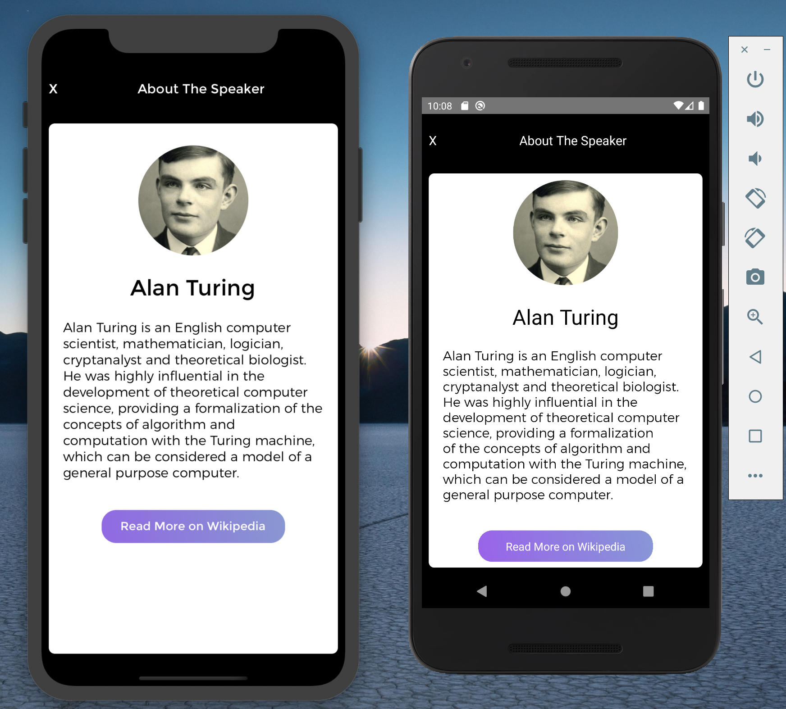

# R10

R10 is a mobile app on both ios and android for a conference schedule by using react native

# Author and Take-away

This is my first react native app. A lot of new technology and thinking process learned from the project

# Installation

## ios

need Xcode

```
react-native run-ios
```

## Android

need Android simulator

```
react-native run-android
```

Google-map: add API Key to android/app/src/main/androidManifest.xml

# Technology used

- react (stateful and stateless)
- react native
- Moment.js
- node.js
- Apollo client
- context
- Async and await
- AsyncStorage
- React Native Vector Icons

# ScreenShot

## IOS and Android











# Personal Learnings

- Learned how to use React Native specific components and styling techniques
- Learned how to use Layout Animation and other Animation techniques
- Learned how to push and pop scenes in the stack
- Learned how to conditionally render components based on platform used
- Learned how to integrate Google maps in ios and android.
